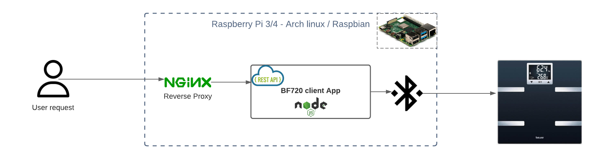

# open-BF720
Solution for automatic sync of weight measurements from a Beurer BF 720 scale. 

Application will sync measurements from the scale at a predefined rate (Cron schedule). Measurements are stored by the application in a file on the RPI. Synced measurements can be retreived using the application REST API.





## Use case

Solution allows for easy storage and automatic retrieval of weight measurements from the scale. An user only needs to weigh in. At a predefined schedule the app will sync measurements from the scale to the RPI (default schedule: once every 24h, at midnight). 

- Supported user requests (REST):
    - List scales (Bluetooth scan for BF720 devices)
    - Get existing scale settings
    - Create scale settings
    - Register new user
    - List all measurements
    - List all measurements for a user
    - Login user (sync with scale for new measurements)

Complete list with examples: See postman collection: **open-bf720.postman_collection.json**

# Prerequisites
- Environment for running npm/node 
- Bluetooth BLE dongle

Instructions in this readme: installing application on Raspberry Pi 4 running Arch linux OS

## Configuring Rpi (Arch linux)


### Bluetooth

Install bluetooth pacman packages:
```sh
$ sudo pacman -Sy bluez bluez-libs bluez-utils
```

Check if the the kernel found the bluetooth device:
```sh 
$ sudo dmesg | grep Bluetooth

> 
[    9.801493] Bluetooth: Core ver 2.22
[    9.801545] Bluetooth: HCI device and connection manager initialized
[    9.801562] Bluetooth: HCI socket layer initialized
[    9.801572] Bluetooth: L2CAP socket layer initialized
[    9.801587] Bluetooth: SCO socket layer initialized
[    9.863647] Bluetooth: hci0: unexpected event for opcode 0x0000
[   10.078534] Bluetooth: hci0: hardware error 0x35
[   10.925171] Bluetooth: BNEP (Ethernet Emulation) ver 1.3
[   10.925186] Bluetooth: BNEP filters: protocol multicast
[   10.925201] Bluetooth: BNEP socket layer initialized
```

Check that bluetooth service is running
```
$ systemctl status bluetooth

> bluetooth.service - Bluetooth service
     Loaded: loaded (/usr/lib/systemd/system/bluetooth.service; enabled; vendor preset: disabled)
     Active: active (running) since Mon 2021-02-15 11:08:28 CET; 1 months 2 days ago
       Docs: man:bluetoothd(8)
   Main PID: 302 (bluetoothd)
     Status: "Running"
      Tasks: 1 (limit: 4915)
     CGroup: /system.slice/bluetooth.service
             `-302 /usr/lib/bluetooth/bluetoothd
``` 

If not, enable and start the service:

```sh
$ sudo systemctl enable bluetooth
$ sudo systemctl start bluetooth
```


### Nginx
Nginx is used as a reverse proxy for routing everything to http://localhost:3000 - the endpoint for the BF720 REST API.

1. Install Nginx
```sh
$ sudo pacman -Sy nginx
```

2. Create nginx configuration file: /etc/nginx/sites-available/default (note sites-available folder might need to be created)
```sh
# /etc/nginx/sites-available/default contents:
server {
        listen 80 default_server;
        listen [::]:80 default_server;

        root /var/www/html;
        index index.html index.htm index.nginx-debian.html;

        server_name _;
    location / {
        proxy_pass http://localhost:3000;
        proxy_http_version 1.1;
        proxy_set_header Upgrade $http_upgrade;
        proxy_set_header Connection 'upgrade';
        proxy_set_header Host $host;
        proxy_cache_bypass $http_upgrade;
    }
}
```

3. Enable and start Nginx

```sh 
$ sudo systemctl enable nginx.service
$ sudo systemctl start nginx.service
```

## NPM & Node
Install nodejs and NPM
```sh
$ sudo pacman -Sy nodejs
$ sudo pacman -Sy npm
```

Check installed versions:
```sh
# Versions
$ node --version
> v15.5.1

$ npm --version
> 6.14.11
```

Grant the node binary **cap_net_raw privileges**, so it can start/stop BLE advertising.
```sh
sudo setcap cap_net_raw+eip $(eval readlink -f `which node`)
```

## PM2 - Process manager for node.js
PM2 is used to ensure that the application is running reliably and automatically (if the Rpi would restart).

Install pm2
```sh
$ sudo npm install -g pm2
```

Register pm2 to start automatically at RPI boot
```sh
$ sudo pm2 startup
```

# Application configuration
The application will need to be configured before use. 

Two configuration are required:
1. Application boot configuration
    - **Port** - for exposing the endpoint (default 3000)
    - **Debug level** - (default: warn)
    - **Cron schedule** - (default: once per day 1 min past midnight: '1 0 * * *')
2. Scale & User configuration in application
    - Scan for bluetooth scale and register it in app
    - Add user(s)

## Application boot configuration
Rename the **example.env** file to **.env** file and edit the corresponding paramaters.

## Scale & User configuration in application

### 1. Begin with making a request for available scales

GET (/manage/availableScales): List scales:
``` json
# Rest Response
[
    {
        "id": "c8b21ecc5222",
        "name": "BF720"
    }
]
```
### 2. Create scale setting 
Take id from the found scale and send the following POST request:

POST (/manage/settings): Create scaling setting
``` json
# Body JSON payload
{
    "id": "c8b21ecc5222",
    "name": "My BF720 scale"
}
```

### 3. Add an user by sending the following POST request

POST (/user/add): Add new user
```json
# Body JSON payload
{
    "name":"Foo",
    "gender": "m",
    "dateOfBirth":"1930-01-01",
    "heightInCm": 177
}
```

**Note**: The scale will turn on. The user that is being registered should now stand on in att wait for the intial measurement to complete.

### 4. Confirm that the user exists

GET(/user/): List users
```json
# Rest Response
[
    {
        "id": "6d94500c-5024-4ffd-b1a9-358c261b98da",
        "name": "Foo",
        "initials": "F",
        "heightInCm": 156,
        "gender": "m",
        "dateOfBirth": "1985-03-02",
        "consentCode": 9490,
        "index": 1
    }
]
```

### 5. To check(sync) for new measurements (stored on the scale) 

POST(/user/login): Login user
```json
# Body JSON payload
{
    "userIndex":1
}
```

### 6. Fetch all stored measurements

GET (/measurements/): Get all measurements
```json
[
    {
        "index": 1,
        "weightInKg": 77.34,
        "timestamp": "2021-01-03T19:53:53.000Z",
        "id": "6d94800c-5024-4ffd-b1a9-358c261b98da"
    }
]
```

The scale and application are now correctly set up with one registered user. Register more users by repeating **step 3**.

# Build application

```sh
$ npm install
$ npm build
```

# Run

```sh
$ npm start
```

## Run using pm2 (Preferred option)

```sh
$ pwd
> ~/open-BF720

$ ls 
> README.md  build  measurements.json  node_modules  nodemon.json  package-lock.json  package.json  scale_settings.json  src  tsconfig.json  users.json

$ sudo pm2 start build/app.js
```

Save the running application. (PM2 will now automatically start the application if RPI reboots)
```sh
$ sudo pm2 save
```